# Architecture Decision Records

Architecture Decision Records preserve the reasoning behind consequential
technical and process decisions in this project.  They are intentionally more
verbose than operational summaries because context, alternatives, constraints,
promises, non-promises, failure models, and rejected options are part of the
architectural record.

The repository uses a layered documentation model:

- ADRs explain why durable decisions exist and what constraints follow from
  them.
- `doc/decisions.md` summarizes each decision in one to three sentences and links
  to the governing ADR.
- `AGENTS.md` is a concise operational map that points back to governing
  documentation rather than repeating its reasoning.
- `doc/bashlog-spec.md` defines the accepted normative observable public
  behavior.
- Doxygen comments preserve local implementation contracts and reasoning near
  the code that depends upon them.
- Tests and CI verify observable behavior and selected architectural invariants.

The ADR template includes `Promises`, `Non-Promises`, `Adversary and Failure
Model`, and `Operational Constraints` sections.  Consequential ADRs should use
those sections when they make the decision boundary clearer.  The operational
constraints are a compact representation of the decision for implementation and
review; they do not replace the surrounding rationale.

See [`doc/decisions.md`](../decisions.md) for the concise current decision map.

## Index

### Accepted

* [ADR-000: Capability Scope, Epistemic Honesty, and Separation of Concerns](ADR-000-capability-scope-and-epistemic-honesty.md)
* [ADR-001: Documentation and Decision Hierarchy](ADR-001-documentation-and-decision-hierarchy.md)
* [ADR-002: Bash Runtime and Portability Baseline](ADR-002-bash-runtime-and-portability-baseline.md)
* [ADR-003: Make as the Canonical Orchestration Interface](ADR-003-make-as-canonical-orchestration-interface.md)
* [ADR-004: Modular Source Assembly and Automatically Discovered Plugins](ADR-004-modular-source-and-plugin-discovery.md)
* [ADR-005: Dependency Management and Explicit Network Boundaries](ADR-005-dependency-management-and-network-boundaries.md)
* [ADR-006: Three Release Artifact Flavors, Metadata, and Checksums](ADR-006-release-artifact-flavors-and-metadata.md)
* [ADR-007: Doxygen-Based Verbose Source Documentation Standard](ADR-007-doxygen-verbose-source-documentation.md)
* [ADR-008: Documentation-Driven, Test-Second Development](ADR-008-documentation-driven-test-second-development.md)
* [ADR-009: Observable Behavior Testing Across Shipped Artifacts](ADR-009-observable-behavior-testing.md)
* [ADR-010: Generated Reference Documentation Is Ephemeral](ADR-010-generated-reference-documentation.md)
* [ADR-011: Conventional-Commit Semantic Releases and Late Tagging](ADR-011-conventional-semver-and-late-tagging.md)
* [ADR-012: Standardize SHA-256 Checksum Companion Filenames](ADR-012-standardize-sha256-checksum-companion-filenames.md)
* [ADR-013: Sourceable Library Scope and Responsibility Boundary](ADR-013-sourceable-library-scope-and-responsibility-boundary.md)
* [ADR-014: Pure Bash Runtime and External Command Boundary](ADR-014-pure-bash-runtime-and-external-command-boundary.md)
* [ADR-015: Namespaced Public API and Caller-Owned Convenience Wrappers](ADR-015-namespaced-public-api-and-caller-owned-convenience-wrappers.md)
* [ADR-016: Modular Source Assembly for a Sourceable Library](ADR-016-modular-source-assembly-for-a-sourceable-library.md)
* [ADR-017: Logging Pipeline, Levels, Formatting, and Emission](ADR-017-logging-pipeline-levels-formatting-and-emission.md)
* [ADR-018: Redaction as an Opt-In Security Boundary](ADR-018-redaction-as-an-opt-in-security-boundary.md)
* [ADR-019: Readability, Auditability, and Rejection of Obscurity](ADR-019-readability-auditability-and-rejection-of-obscurity.md)
* [ADR-020: Redaction Context Lifecycle and State Model](ADR-020-redaction-context-lifecycle-and-state-model.md)
* [ADR-021: Redaction Rule Registration, Ordering, and Replacement Semantics](ADR-021-redaction-rule-registration-ordering-and-replacement.md)
* [ADR-022: Fixed-String Redaction and Multibyte Guarantees](ADR-022-fixed-string-redaction-and-multibyte-guarantees.md)
* [ADR-023: Glob and ERE Redaction Semantics](ADR-023-glob-and-ere-redaction-semantics.md)
* [ADR-024: Final Redaction Verification and Fail-Closed Output Boundary](ADR-024-final-redaction-verification-and-fail-closed-output.md)
* [ADR-025: Optional Presentation Metadata, Tags, and Color](ADR-025-optional-presentation-metadata-tags-and-color.md)
* [ADR-026: Adaptive Human/Logfmt Rendering and Environment-Agnostic Stderr Transport](ADR-026-adaptive-human-logfmt-rendering-and-stderr-transport.md)
* [ADR-027: Configurable Severity Token Styles](ADR-027-configurable-severity-token-styles.md)
* [ADR-028: Generate Committed ADR Navigation with a Pinned adrctl Documentation Dependency](ADR-028-generate-committed-adr-navigation-with-pinned-adrctl.md)
* [ADR-029: Compose a Mermaid Relationship Graph into the Generated ADR Index](ADR-029-compose-mermaid-relationship-graph-into-generated-adr-index.md)

## Decision Relationships

```mermaid
flowchart TD
  _0["ADR-000: Capability Scope, Epistemic Honesty, and Separation of Concerns"]
  _1["ADR-001: Documentation and Decision Hierarchy"]
  _2["ADR-002: Bash Runtime and Portability Baseline"]
  _3["ADR-003: Make as the Canonical Orchestration Interface"]
  _4["ADR-004: Modular Source Assembly and Automatically Discovered Plugins"]
  _5["ADR-005: Dependency Management and Explicit Network Boundaries"]
  _6["ADR-006: Three Release Artifact Flavors, Metadata, and Checksums"]
  _7["ADR-007: Doxygen-Based Verbose Source Documentation Standard"]
  _8["ADR-008: Documentation-Driven, Test-Second Development"]
  _9["ADR-009: Observable Behavior Testing Across Shipped Artifacts"]
  _10["ADR-010: Generated Reference Documentation Is Ephemeral"]
  _11["ADR-011: Conventional-Commit Semantic Releases and Late Tagging"]
  _12["ADR-012: Standardize SHA-256 Checksum Companion Filenames"]
  _13["ADR-013: Sourceable Library Scope and Responsibility Boundary"]
  _14["ADR-014: Pure Bash Runtime and External Command Boundary"]
  _15["ADR-015: Namespaced Public API and Caller-Owned Convenience Wrappers"]
  _16["ADR-016: Modular Source Assembly for a Sourceable Library"]
  _17["ADR-017: Logging Pipeline, Levels, Formatting, and Emission"]
  _18["ADR-018: Redaction as an Opt-In Security Boundary"]
  _19["ADR-019: Readability, Auditability, and Rejection of Obscurity"]
  _20["ADR-020: Redaction Context Lifecycle and State Model"]
  _21["ADR-021: Redaction Rule Registration, Ordering, and Replacement Semantics"]
  _22["ADR-022: Fixed-String Redaction and Multibyte Guarantees"]
  _23["ADR-023: Glob and ERE Redaction Semantics"]
  _24["ADR-024: Final Redaction Verification and Fail-Closed Output Boundary"]
  _25["ADR-025: Optional Presentation Metadata, Tags, and Color"]
  _26["ADR-026: Adaptive Human/Logfmt Rendering and Environment-Agnostic Stderr Transport"]
  _27["ADR-027: Configurable Severity Token Styles"]
  _28["ADR-028: Generate Committed ADR Navigation with a Pinned adrctl Documentation Dependency"]
  _29["ADR-029: Compose a Mermaid Relationship Graph into the Generated ADR Index"]
  _0 -.-> _1
  _1 -.-> _2
  _2 -.-> _3
  _3 -.-> _4
  _4 -.-> _5
  _5 -.-> _6
  _6 -.-> _7
  _7 -.-> _8
  _8 -.-> _9
  _9 -.-> _10
  _10 -.-> _11
  _11 -.-> _12
  _12 -.-> _13
  _13 -.-> _14
  _14 -.-> _15
  _15 -.-> _16
  _16 -.-> _17
  _17 -.-> _18
  _18 -.-> _19
  _19 -.-> _20
  _20 -.-> _21
  _21 -.-> _22
  _22 -.-> _23
  _23 -.-> _24
  _24 -.-> _25
  _25 -.-> _26
  _26 -.-> _27
  _27 -.-> _28
  _28 -.-> _29
  click _0 "https://github.com/wesley-dean/bashlog/blob/main/doc/adr/ADR-000-capability-scope-and-epistemic-honesty.md"
  click _1 "https://github.com/wesley-dean/bashlog/blob/main/doc/adr/ADR-001-documentation-and-decision-hierarchy.md"
  click _2 "https://github.com/wesley-dean/bashlog/blob/main/doc/adr/ADR-002-bash-runtime-and-portability-baseline.md"
  click _3 "https://github.com/wesley-dean/bashlog/blob/main/doc/adr/ADR-003-make-as-canonical-orchestration-interface.md"
  click _4 "https://github.com/wesley-dean/bashlog/blob/main/doc/adr/ADR-004-modular-source-and-plugin-discovery.md"
  click _5 "https://github.com/wesley-dean/bashlog/blob/main/doc/adr/ADR-005-dependency-management-and-network-boundaries.md"
  click _6 "https://github.com/wesley-dean/bashlog/blob/main/doc/adr/ADR-006-release-artifact-flavors-and-metadata.md"
  click _7 "https://github.com/wesley-dean/bashlog/blob/main/doc/adr/ADR-007-doxygen-verbose-source-documentation.md"
  click _8 "https://github.com/wesley-dean/bashlog/blob/main/doc/adr/ADR-008-documentation-driven-test-second-development.md"
  click _9 "https://github.com/wesley-dean/bashlog/blob/main/doc/adr/ADR-009-observable-behavior-testing.md"
  click _10 "https://github.com/wesley-dean/bashlog/blob/main/doc/adr/ADR-010-generated-reference-documentation.md"
  click _11 "https://github.com/wesley-dean/bashlog/blob/main/doc/adr/ADR-011-conventional-semver-and-late-tagging.md"
  click _12 "https://github.com/wesley-dean/bashlog/blob/main/doc/adr/ADR-012-standardize-sha256-checksum-companion-filenames.md"
  click _13 "https://github.com/wesley-dean/bashlog/blob/main/doc/adr/ADR-013-sourceable-library-scope-and-responsibility-boundary.md"
  click _14 "https://github.com/wesley-dean/bashlog/blob/main/doc/adr/ADR-014-pure-bash-runtime-and-external-command-boundary.md"
  click _15 "https://github.com/wesley-dean/bashlog/blob/main/doc/adr/ADR-015-namespaced-public-api-and-caller-owned-convenience-wrappers.md"
  click _16 "https://github.com/wesley-dean/bashlog/blob/main/doc/adr/ADR-016-modular-source-assembly-for-a-sourceable-library.md"
  click _17 "https://github.com/wesley-dean/bashlog/blob/main/doc/adr/ADR-017-logging-pipeline-levels-formatting-and-emission.md"
  click _18 "https://github.com/wesley-dean/bashlog/blob/main/doc/adr/ADR-018-redaction-as-an-opt-in-security-boundary.md"
  click _19 "https://github.com/wesley-dean/bashlog/blob/main/doc/adr/ADR-019-readability-auditability-and-rejection-of-obscurity.md"
  click _20 "https://github.com/wesley-dean/bashlog/blob/main/doc/adr/ADR-020-redaction-context-lifecycle-and-state-model.md"
  click _21 "https://github.com/wesley-dean/bashlog/blob/main/doc/adr/ADR-021-redaction-rule-registration-ordering-and-replacement.md"
  click _22 "https://github.com/wesley-dean/bashlog/blob/main/doc/adr/ADR-022-fixed-string-redaction-and-multibyte-guarantees.md"
  click _23 "https://github.com/wesley-dean/bashlog/blob/main/doc/adr/ADR-023-glob-and-ere-redaction-semantics.md"
  click _24 "https://github.com/wesley-dean/bashlog/blob/main/doc/adr/ADR-024-final-redaction-verification-and-fail-closed-output.md"
  click _25 "https://github.com/wesley-dean/bashlog/blob/main/doc/adr/ADR-025-optional-presentation-metadata-tags-and-color.md"
  click _26 "https://github.com/wesley-dean/bashlog/blob/main/doc/adr/ADR-026-adaptive-human-logfmt-rendering-and-stderr-transport.md"
  click _27 "https://github.com/wesley-dean/bashlog/blob/main/doc/adr/ADR-027-configurable-severity-token-styles.md"
  click _28 "https://github.com/wesley-dean/bashlog/blob/main/doc/adr/ADR-028-generate-committed-adr-navigation-with-pinned-adrctl.md"
  click _29 "https://github.com/wesley-dean/bashlog/blob/main/doc/adr/ADR-029-compose-mermaid-relationship-graph-into-generated-adr-index.md"
```

## Templates

New ADRs should begin with [`templates/template.md`](templates/template.md).
The template intentionally encourages a "more is more" posture for consequential
decisions while allowing irrelevant optional sections to be removed when a
narrow decision genuinely does not need them.
