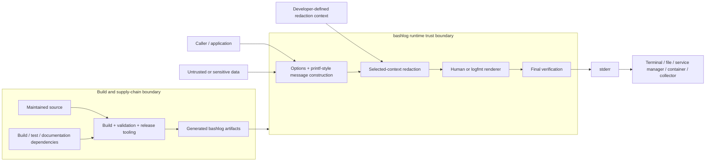

# Threat Model

This document collects bashlog's security assumptions, attack surfaces, trust
boundaries, abuse cases, mitigations, and residual risks into one review surface.
It synthesizes the Accepted ADRs and normative specification; it does not replace
them.

When this document conflicts with an Accepted ADR or `doc/bashlog-spec.md`, treat
the conflict as a documentation defect and resolve it explicitly.

## Why a Logging Library Needs a Threat Model

Logging is often treated as passive plumbing.  In practice, a logger sits on a
data-egress boundary, transforms caller-controlled text, may receive credentials
or private identifiers, writes to a sink consumed by humans and machines, and may
become a dependency deep inside other tools.

The historical Log4Shell vulnerability in Log4j is a reminder that code labeled
"logging" is not automatically low-risk.  bashlog deliberately avoids the class
of runtime evaluation and network behavior involved in that incident, but the
broader lesson remains: every dependency and every data-processing boundary
should be considered fresh attack surface.

## Security Objectives

bashlog's security objectives are intentionally bounded.

1. If a developer explicitly selects a valid redaction context, matching protected
   content must not be emitted through the bashlog logging sink when bashlog can
   detect the match under the documented matcher semantics.
2. Redaction failure must suppress the protected record rather than fall back to
   unredacted output.
3. Replacement text must remain literal data and never become an evaluation or
   expansion language.
4. Redaction state must not be intentionally exposed through public retrieval
   APIs, persistence, child-process environment export, or runtime helper
   subprocesses.
5. Sourcing bashlog must not silently alter caller control flow, traps, shell
   options, working directory, aliases, or generic function names.
6. Runtime logging/redaction must not invoke external commands or silently access
   the network.
7. Presentation must not weaken the selected redaction boundary; final rendered
   output receives a non-transforming verification step before emission.
8. The implementation must remain readable enough that these claims can be
   reviewed from maintained Bash source.

## Assets

The threat model is concerned with protecting or preserving:

- values and patterns explicitly entrusted to redaction contexts;
- caller messages and tags before they reach stderr;
- the integrity of severity, threshold, renderer, timestamp, color, and style
  configuration;
- stdout as a caller-owned application-data channel;
- caller shell state at source time and during ordinary operation;
- the integrity of generated release artifacts and their checksum companions;
- the integrity of dependency bytes used to build, test, document, and release
  bashlog; and
- developer trust in the documented boundary between guarantees and non-guarantees.

## Trusted Computing Base

Within the documented model, bashlog necessarily trusts:

- the Bash interpreter and its documented semantics at the supported runtime
  floor;
- bashlog's own maintained source and generated artifact bytes;
- the caller to decide what data is sensitive and when to select a redaction
  context;
- the caller to avoid exposing sensitive arguments through caller-side tracing or
  unrelated output paths;
- repository/build tooling when producing release artifacts; and
- dependencies used by build, test, documentation, and release workflows within
  the authority those workflows grant them.

A checksum proves that acquired dependency bytes match an expected digest.  It does
not prove those bytes are free of vulnerabilities or appropriate for the
privileges/data they receive.

## Trust Boundaries

The diagram below is intentionally architectural rather than implementation-level.
It shows where data or authority changes ownership and where bashlog's documented
security guarantees begin and end.



The important boundary is not merely the box labeled `bashlog`.  A redaction
context becomes security-relevant only when the caller explicitly selects it, and
bashlog's confidentiality guarantee ends when verified bytes are emitted to
stderr.  Downstream storage, transport, parsing, display, retention, and access
control belong to the consuming environment.

### Caller to bashlog

Caller-supplied format strings, arguments, tags, context names, matcher patterns,
replacement text, and configuration requests cross into bashlog.

bashlog validates syntax and documented tokens but does not infer whether the
caller made a wise application-policy choice.

### Redaction state to logging pipeline

An explicit `--context CONTEXT` selection changes the operation from ordinary
logging to a fail-closed protected path.  Registered contexts remain inert for a
logging call that does not select them.

### Semantic data to presentation

Logger-managed redaction operates on the formatted semantic message and
caller-supplied tags before human punctuation, logfmt escaping, or bashlog-owned
ANSI styling.

The completed rendered record is then verified again against the selected context.

### bashlog to stderr

stderr is the universal bashlog sink.  Once bytes are written, downstream storage,
forwarding, parsing, display, retention, and access control belong to the caller's
environment.

### Maintained source to generated artifacts

Concatenation, comment stripping, and minification are transformation boundaries.
All shipped artifact flavors are tested because generated bytes are product
surfaces rather than assumed-safe build intermediates.

### Repository to external dependencies

Dependency acquisition, build tooling, scanners, documentation filters, CI
components, and release actions expand the software supply-chain trust boundary.
They may have authority over source, artifacts, credentials, tags, attestations, or
publication even when they are absent from consumer runtime.

## Entry Points and Data Flows

The primary public entry points are:

```text
configuration getters/setters
    -> process-local logging/presentation state

bashlog_redaction_add
    -> validated sensitive matcher/replacement state

bashlog_redact
    -> caller-provided text
    -> selected context transform + verification
    -> stdout on success

bashlog_LEVEL / bashlog_log
    -> options / format / arguments / tags
    -> threshold decision
    -> semantic printf construction
    -> optional selected-context transformation
    -> renderer serialization
    -> optional severity styling
    -> final verification when context selected
    -> stderr
```

No runtime path intentionally invokes a helper subprocess or network transport.

## Threat Actors and Failure Sources

"Threat" is broader here than a malicious remote attacker.  Relevant actors and
failure sources include:

- an application developer accidentally logging a secret;
- a developer forgetting to select a redaction context;
- attacker-controlled text entering a log message or tag;
- malformed or pathological glob/ERE patterns;
- replacement strings containing shell/pattern metacharacters;
- same-process Bash code inspecting shell variables or functions;
- caller-side `set -x` tracing;
- a compromised Bash interpreter or privileged local observer;
- a compromised or vulnerable dependency in build/CI/release tooling;
- an implementation regression that bypasses final verification;
- a renderer change that alters sensitive bytes before matching;
- a generated-artifact transformation that changes runtime behavior;
- downstream log processors that interpret emitted text in dangerous ways; and
- future maintainers inferring a broader guarantee than the architecture makes.

## Threats, Mitigations, and Residual Risk

### T1: Sensitive value emitted through an explicitly protected logging call

**Threat:** A message or tag contains a value matching a rule in the explicitly
selected context.

**Mitigations:**

- primary semantic-field redaction before rendering;
- ordered bounded rule application;
- literal replacement semantics;
- final non-transforming verification of the completed record;
- fail-closed suppression on transformation, verification, or matcher failure;
- negative tests asserting absence of protected originals.

**Residual risk:** Matching is only as complete as the developer's selected
context and the documented matcher semantics.  Unknown encodings, alternate
Unicode representations, transformations performed before bashlog, or data not
registered as sensitive remain outside the guarantee.

### T2: Developer forgets or declines to select a redaction context

**Threat:** Sensitive data is logged through an ordinary call with no `--context`.

**Mitigations:**

- explicit documentation that logging is a data-egress boundary;
- visible `--context CONTEXT` API;
- direct `bashlog_redact` workflow for caller-managed protection;
- no misleading claim that registered contexts apply automatically.

**Residual risk:** This is intentionally developer-owned policy.  bashlog does not
heuristically inspect unprotected calls against every registered context.

### T3: Redaction failure falls back to original data

**Threat:** An invalid, unavailable, or failing redaction operation emits the
unredacted message in the name of logging availability.

**Mitigations:**

- fail-closed return semantics;
- fixed safe diagnostic candidate;
- diagnostic itself is verified when an active context is available;
- tests for suppression paths.

**Residual risk:** Suppression can reduce observability during failure.  That cost
is accepted once the caller explicitly selected a security boundary.

### T4: Replacement text becomes code or secondary pattern language

**Threat:** Replacement values containing `$()`, `${}`, `&`, `\1`, glob syntax,
or similar text acquire evaluation semantics.

**Mitigations:**

- replacement text is an explicit literal-data contract;
- implementation avoids `eval` and unsafe replacement mechanisms;
- tests exercise shell/pattern metacharacters as data.

**Residual risk:** A downstream consumer may later interpret emitted replacement
text under its own rules.  bashlog cannot control transformations after emission.

### T5: Pattern matcher becomes unbounded or bypassable

**Threat:** Zero-length glob/ERE rules, ambient `nocasematch`, extglob state, or
anchored ERE location bugs produce infinite progress, incorrect matching, or
unexpected bypasses.

**Mitigations:**

- zero-length-capable glob/ERE rejection;
- deliberately limited glob contract;
- explicit `nocasematch` snapshot/disable/restore behavior;
- anchored ERE regression tests;
- bounded non-overlapping progression.

**Residual risk:** Glob and ERE semantics remain subject to caller locale where
Bash/libc defines locale-sensitive behavior.  `fixed` remains preferred for known
exact secrets.

### T6: Secret exposed before bashlog gains control

**Threat:** Caller-side `set -x` prints expanded arguments at the function call.

**Mitigations:**

- prominent documentation of the xtrace boundary;
- no claim that bashlog can retroactively remove already-emitted trace output.

**Residual risk:** The caller owns tracing configuration.  This threat is outside
the redaction sink boundary.

### T7: Hostile same-process code reads redaction state

**Threat:** Another function or sourced component inspects bashlog's shell
variables containing registered values.

**Mitigations:**

- no public secret retrieval API;
- no intentional persistence or child-process export;
- no runtime helper subprocess;
- readable internal naming rather than fake obfuscation.

**Residual risk:** Bash does not provide private memory or secure module
encapsulation.  Hostile code in the same interpreter is outside the confidentiality
boundary.

### T8: Terminal control or log-forging content in human rendering

**Threat:** Caller-controlled message text contains newline, carriage-return,
backspace, ESC, or other terminal/control bytes.  Human rendering is intentionally
textual and may allow those bytes to affect visual presentation or create apparent
additional lines.

**Mitigations:**

- bashlog-owned ANSI is bounded to the severity signifier;
- logfmt deterministically escapes control bytes and is selected automatically for
  non-TTY stderr;
- tags are restricted to a narrow ASCII grammar.

**Residual risk / review trigger:** Human message text is not currently a general
terminal-sanitization layer.  Applications that log untrusted text interactively
should recognize terminal-injection and line-forging risk.  Changing human
message escaping would alter observable behavior and requires a separate
architecture/specification decision rather than an undocumented mitigation.

### T9: Downstream parser interprets emitted text dangerously

**Threat:** A log collector, terminal, shell pipeline, template engine, or parser
applies semantics that bashlog does not control.

**Mitigations:**

- deterministic logfmt quoting/escaping for machine-oriented output;
- no bashlog runtime shell evaluation of emitted content;
- environment-agnostic stderr transport boundary.

**Residual risk:** Downstream systems are outside bashlog's trust boundary and must
be threat-modeled by the consuming application/deployment.

### T10: Dependency or supply-chain compromise

**Threat:** A build, test, documentation, CI, scanner, release, or vendored
dependency is vulnerable or compromised.

**Mitigations:**

- pinned dependency versions/digests where supported;
- explicit network acquisition boundary;
- offline prepared-state verification/build surfaces;
- standalone runtime artifact with no bashlog runtime dependency subprocesses;
- exact release-artifact checksums and attestations.

**Residual risk:** Pinning verifies identity, not safety.  Build/release tools retain
authority over produced artifacts and publication.  Every dependency remains fresh
attack surface and must be reviewed according to its authority and data exposure.

### T11: Generated artifact differs from maintained-source behavior

**Threat:** Concatenation, comment stripping, or minification introduces a semantic
change that bypasses a security property.

**Mitigations:**

- identical behavior suite against all three artifacts;
- Bash 4.3 compatibility execution against all artifact flavors;
- deterministic build/checksum validation;
- consumer-independence test after repository dependency state is removed.

**Residual risk:** Tests are finite evidence, not proof.  Review must still compare
maintained source and generated behavior when build transformations change.

### T12: Logging availability conflicts with confidentiality

**Threat:** Fail-closed redaction suppresses a record operators would prefer to
have during an incident.

**Mitigation:** The architecture explicitly chooses confidentiality of an
explicitly protected record over availability of that record.

**Residual risk:** Operators may lose diagnostic context.  Applications should
avoid unnecessary sensitive data in messages and design observability so a
suppressed protected record is not the only source of critical state.

## Explicit Non-Goals

This threat model does not claim protection against:

- root, kernel compromise, debuggers, `ptrace`, core dumps, or equivalent
  privileged memory inspection;
- a compromised Bash interpreter;
- hostile code intentionally executing in the same Bash process;
- caller output paths that bypass bashlog;
- sensitive data emitted before a context is registered/selected;
- secure memory allocation, locking, or zeroization;
- Unicode normalization equivalence;
- embedded NUL data;
- arbitrary downstream parser/evaluator behavior;
- secrecy of application data after it leaves bashlog's stderr boundary; or
- vulnerabilities in a dependency merely because its bytes were checksum
  verified.

## Security Evidence

Security claims should be supported by multiple forms of evidence:

- ADR-014: no runtime external commands;
- ADR-018: explicit redaction security boundary and non-promises;
- ADR-019: readability/auditability requirements;
- ADR-020 through ADR-023: context/rule/matcher semantics;
- ADR-024: final fail-closed verification;
- ADR-026: semantic-data-before-presentation ordering and stderr boundary;
- `doc/bashlog-spec.md`: normative observable behavior;
- `tests/contract/`: positive and negative public/security tests;
- `tests/contract/compat-bash43.bash`: representative behavior at the supported
  runtime floor; and
- release verification of exact generated artifact bytes and `.sha256`
  companions.

No single layer is treated as proof by itself.

## Threat-Model Review Triggers

Review this document when a change proposes any of the following:

- a new runtime dependency;
- a new logging sink or transport;
- direct network access;
- file output or persistence;
- a new renderer or escaping model;
- a change to human handling of control characters or newlines;
- heuristic sensitive-data discovery;
- a new matcher language;
- runtime plugin/dynamic-loading behavior;
- a new public API exposing redaction state or metadata;
- a higher Bash runtime floor;
- a change in generated artifact/build transformation;
- new build/release tooling with publication authority; or
- a broader security, privacy, or confidentiality claim.

The purpose of the exercise is not to make the document longer.  It is to ensure
that changes which expand authority, data exposure, or trust receive deliberate
review rather than being treated as ordinary feature additions.
